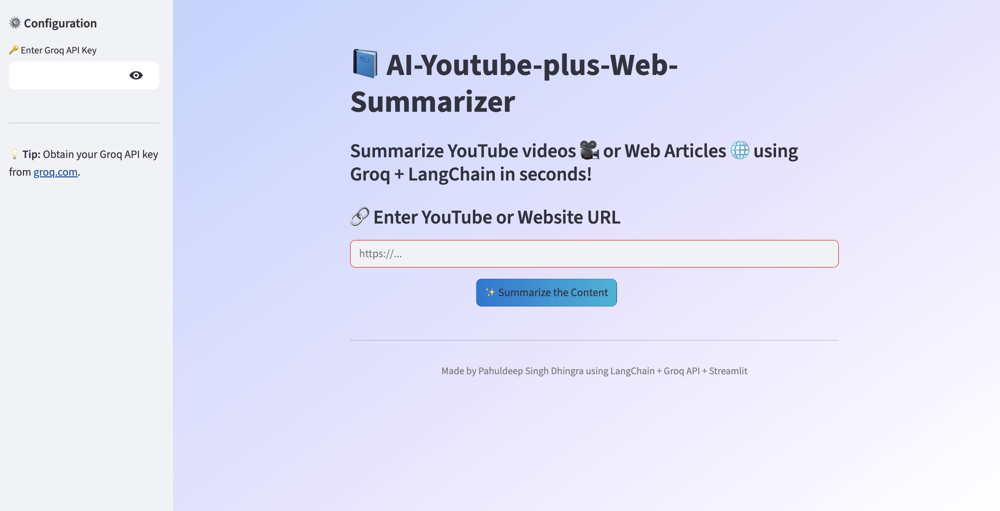
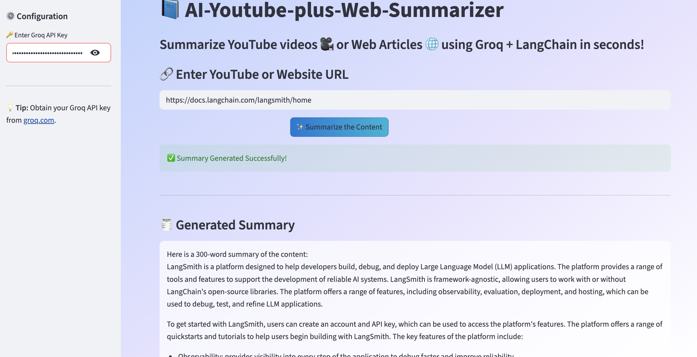

# 📚 AI-Youtube-plus-Web-Summarizer
A LangChain + Groq powered Streamlit application that automatically summarizes YouTube videos and web articles into concise 300-word summaries using state-of-the-art LLMs.

---

## 🖼️ Application Preview

#### Home Screen
 

#### Summary Output
 

---


## 🚀 Features

- 🔗 Accepts **YouTube video links** or **website URLs**
- 🤖 Uses **Groq LLM (llama-3.3-70b-versatile)** for natural language summarization  
- ⚡ Built with **LangChain Summarization Chains**
- 🎨 Interactive and modern Streamlit UI
- 🧠 Automatically extracts YouTube transcripts or web content
- 🔒 Secure API key input through sidebar

---

## 🧩 Tech Stack

| Component | Technology |
|:--|:--|
| Frontend | Streamlit |
| LLM Model | Groq – LLaMA 3.3 (70B) |
| Framework | LangChain (PromptTemplate + Summarize Chain) |
| Data Loaders | YouTubeLoader, UnstructuredURLLoader |
| Language | Python 3.10+ |

---


## ⚙️ Setup & Run

1. **Clone the repository**
   ```bash
   git clone https://github.com/pahul1712/SmartSummarizer-AI-(YT-and-Web).git
   cd SmartSummarizer-AI-(YT-and-Web)
